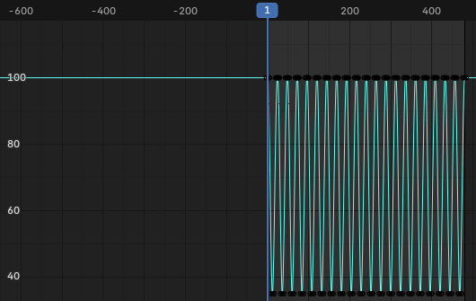

# AC06 — Animação da Cena Noturna

## Aluno
Felipe Ultramar

## Disciplina
Computação Gráfica

## Ferramenta Utilizada
Blender 4.5 LTS

---

# 1. Objetivo

O objetivo desta atividade foi aplicar os conceitos de animação por keyframes utilizando a cena desenvolvida nas atividades anteriores (AC04 e AC05). Foram criadas três animações distintas: variação da intensidade da lâmpada, movimento de câmera e movimentação de um objeto da cena, explorando interpolação, Timeline e Graph Editor.

---

# 2. Configuração da Animação

| Configuração | Valor |
|-------------|--------|
| Frame Rate | 24 fps |
| Frame Inicial | 1 |
| Frame Final | 480 |
| Duração Total | 20 segundos |
| Engine de Render | EEVEE Next |
| Resolução | 1280 × 720 px |

---

# 3. Animação 1 — Lâmpada Piscando

A luz do abajur foi animada por meio da propriedade **Power**, simulando o comportamento de uma lâmpada antiga com pequenas oscilações de intensidade luminosa.

### Keyframes Utilizados

| Frame | Potência |
|---------|---------|
| 1 | 100 W |
| 12 | 35 W |
| 24 | 100 W |

O ciclo foi repetido ao longo de toda a animação até o frame 480. As curvas foram configuradas com interpolação **Bezier**, produzindo transições suaves entre os valores de intensidade.

### Interpolação

- Tipo: Bezier
- Objetivo: suavizar a transição entre os níveis de iluminação e evitar mudanças bruscas de intensidade.

---

# 4. Animação 2 — Movimento de Câmera

Foi criada uma animação de aproximação gradual da câmera em direção à mesa de estudos.

### Keyframes Utilizados

| Frame | Ação |
|---------|---------|
| 1 | Posição inicial da câmera |
| 240 | Aproximação e ajuste de enquadramento |

A movimentação foi configurada com interpolação **Bezier**, criando aceleração e desaceleração suaves durante o deslocamento.

### Objetivo

Simular um movimento cinematográfico de observação da cena, direcionando a atenção para os objetos posicionados sobre a mesa.

---

# 5. Animação 3 — Movimento do Copo

Como animação livre, foi criado um deslocamento gradual do copo sobre a superfície da mesa.

### Keyframes Utilizados

| Frame | Ação |
|---------|---------|
| 1 | Posição inicial |
| 240 | Deslocamento para trás |
| 480 | Deslocamento lateral, contornando o livro |

### Justificativa

A movimentação do copo foi escolhida por ser facilmente perceptível durante a reprodução do vídeo e por adicionar dinamismo à cena, simulando uma interação natural com os objetos do ambiente de estudo.

---

# 6. Graph Editor

As curvas da animação da lâmpada foram ajustadas no Graph Editor utilizando interpolação Bezier.

---

# 7. Renderização Final

A animação foi exportada em formato de vídeo utilizando as seguintes configurações:

| Configuração | Valor |
|-------------|--------|
| Formato | FFmpeg Video |
| Container | MPEG-4 |
| Codec | H.264 |
| Qualidade | High Quality |
| Resolução | 1280 × 720 px |
| Duração | 20 segundos |

O resultado final apresenta uma cena noturna animada contendo iluminação dinâmica, movimentação de câmera e interação entre os objetos da composição.

---

## Arquivos Entregues

- AC06_FelipeUltramar.blend https://drive.google.com/drive/folders/11WjHKMkFyalysK21lc_yCXRsyItMHZ1T?usp=drive_link
- AC06_FelipeUltramar.mp4
- README.md
- graph_editor.png
