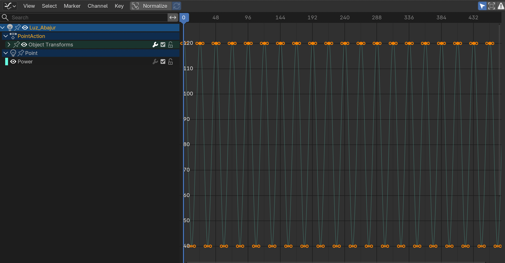

# AC06 – Animação da Cena Noturna

## Descrição das Animações

### 1. Animação da Lâmpada (Luz_Abajur)

A primeira animação consiste na variação da intensidade luminosa da luz interna do abajur, simulando o comportamento de uma lâmpada antiga piscando ao longo da cena.

**Interpolação utilizada:** Bezier

**Keyframes principais:**

| Frame | Potência (W) |
|---------|---------|
| 1 | 120 |
| 12 | 40 |
| 24 | 120 |

O ciclo foi repetido ao longo de toda a animação, produzindo um efeito contínuo de oscilação da intensidade luminosa. A interpolação Bezier foi utilizada para suavizar as transições entre os valores, evitando mudanças abruptas na iluminação.

---

### 2. Movimento de Câmera

A segunda animação foi aplicada à câmera principal da cena. O objetivo foi criar um movimento suave de aproximação e mudança de enquadramento, aumentando o dinamismo visual da composição.

**Interpolação utilizada:** Bezier

**Duração:** Frame 1 ao Frame 480

**Propriedades animadas:**

- Location
- Rotation

A câmera inicia em sua posição original e se desloca gradualmente ao longo da animação, proporcionando uma visualização mais detalhada dos objetos presentes sobre a mesa.

---

### 3. Animação Livre – Deslizamento do Lápis

A animação livre escolhida foi o deslocamento do lápis posicionado sobre o livro.

**Interpolação utilizada:** Bezier

**Duração:** Frame 216 ao Frame 480

**Propriedades animadas:**

- Location
- Rotation

Durante a animação, o lápis desliza sobre a superfície do livro em direção à mesa, simulando um movimento natural causado pela inclinação ou instabilidade do objeto. Além do deslocamento, foi aplicada rotação ao lápis para reforçar a sensação de movimento e torná-lo mais realista.

### Justificativa da Escolha

O lápis foi escolhido por ser um objeto simples de animar e que permite demonstrar simultaneamente transformações de posição e rotação. O movimento contribui para tornar a cena mais dinâmica e visualmente interessante, sem comprometer a composição principal da mesa de estudos.

---

## Print do Graph Editor

