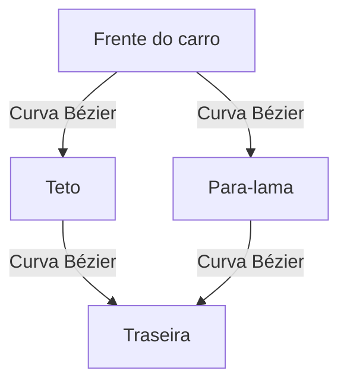

<!--
marp: true
theme: uncover
paginate: true

-->

# Curvas na Modelagem Geométrica

---

## 1. Introdução às Curvas

- Curvas são essenciais para criar formas suaves e detalhadas em modelagem digital.
- Permitem transições naturais entre partes de um objeto, simulando superfícies orgânicas.
- Reduzem a quantidade de polígonos necessários, otimizando o desempenho gráfico.
- Facilitam ajustes precisos no design sem reconstruir toda a geometria.

---

### Exemplo Visual: Perfil de um Automóvel

- O perfil do carro é desenhado com curvas Bézier para garantir suavidade e precisão.
- Pontos de controle permitem criar desde linhas agressivas até formas arredondadas.

---

## 2. Curvas Paramétricas

- Curvas paramétricas: Bézier, B-Splines, NURBS.
- Pontos de controle influenciam a forma da curva.
- Conceitos de interpolação e aproximação.

---

## 3. Ferramentas em Software 3D

- Criação e edição de curvas Bézier e NURBS.
- Manipulação de pontos de controle, tangentes e pesos.
- Exercício: modelagem de superfície simples a partir de uma curva.

---

## 4. Aplicações e Técnicas Avançadas

- Modelagem orgânica e industrial (personagens, veículos).
- Uso de curvas para animação e caminhos de movimento.
- Criação de superfícies complexas a partir de múltiplas curvas.

---

## 5. Exercícios Práticos

- Desenho de figuras geométricas com curvas paramétricas.
- Projeto: modelagem de perfil de objeto (ex: casco de navio).
- Avaliação e refinamento usando pontos de controle.

---

### Referências

- [Curvas Paramétricas em 2D - UFSC](http://lapix.ufsc.br/1.4.-curvas-parametricas-em-2d/)
- [Apostila de Computação Gráfica - UEMS](https://www.comp.uems.br/~mercedes/disciplinas/2023/CG/CG-modelagem.pdf)
- [Vídeo: Curvas em Computação Gráfica](https://www.youtube.com/watch?v=Dh5hKXygxqk)
- [Mais referências no material original]
