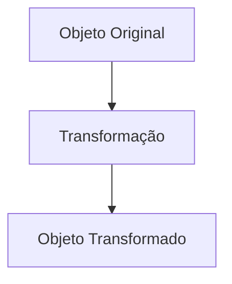

<!-- _class: lead -->
#   
# Transformações Geométricas
### Fundamentos para Modelagem 2D/3D


---

### **Por que Transformações?**
#### Operações essenciais em CG:

1. **Posicionamento** de objetos na cena
2. **Animações** (translação, rotação, escala)
3. **Projeções** (3D → 2D)
4. **Hierarquia** de objetos (ex: braço robótico)




---

<!-- _transition: fade -->
### **Transformações Básicas 2D**

<div class="columns">
<div>

#### 1. Translação
- **Equação:**  
  \( \begin{cases} x' = x + t_x \\ y' = y + t_y \end{cases} \)
- **Matriz:**  
  \( \begin{bmatrix} 1 & 0 & t_x \\ 0 & 1 & t_y \\ 0 & 0 & 1 \end{bmatrix} \)


#### 2. Escala
- **Equação:**  
  \( \begin{cases} x' = s_x \cdot x \\ y' = s_y \cdot y \end{cases} \)

- **Matriz:**  
  \( \begin{bmatrix} s_x & 0 & 0 \\ 0 & s_y & 0 \\ 0 & 0 & 1 \end{bmatrix} \)


---

### **Rotação 2D**
#### Transformação angular em torno da origem

- **Equação:**  
  \( \begin{cases} x' = x \cdot \cos\theta - y \cdot \sin\theta \\ y' = x \cdot \sin\theta + y \cdot \cos\theta \end{cases} \)

- **Matriz Homogênea:**  
  \( \begin{bmatrix} \cos\theta & -\sin\theta & 0 \\ \sin\theta & \cos\theta & 0 \\ 0 & 0 & 1 \end{bmatrix} \)


#### Exemplo Prático:
```python
# Pseudocódigo para rotação
def rotate(point, angle):
    theta = radians(angle)
    return [
        point[0]*cos(theta) - point[1]*sin(theta),
        point[0]*sin(theta) + point[1]*cos(theta)
    ]
```

---

<!-- _transition: slide -->
### **Composição de Transformações**
#### Ordem importa! (Não comutativa)

1. **Sequência correta:**  
   Escala → Rotação → Translação
2. **Problema comum:**  
   Rotacionar em torno de um ponto arbitrário


---

### **Transformações 3D**
#### Extensão do 2D com coordenada \( z \)

<div class="columns">
<div>

#### Translação 3D
\( \begin{bmatrix} 1 & 0 & 0 & t_x \\ 0 & 1 & 0 & t_y \\ 0 & 0 & 1 & t_z \\ 0 & 0 & 0 & 1 \end{bmatrix} \)

#### Escala 3D
\( \begin{bmatrix} s_x & 0 & 0 & 0 \\ 0 & s_y & 0 & 0 \\ 0 & 0 & s_z & 0 \\ 0 & 0 & 0 & 1 \end{bmatrix} \)

</div>
<div>

#### Rotação 3D
Eixos principais:
- **X:** \( R_x(\theta) \)
- **Y:** \( R_y(\theta) \)
- **Z:** \( R_z(\theta) \)


---

### **Aplicações Práticas**
#### Exemplos reais em CG

1. **Hierarquia de Objetos:**  
   ```mermaid
   graph TB
       A[Personagem] --> B[Braço]
       B --> C[Antebraço]
       C --> D[Mão]
   ```

2. **Câmera Virtual:**  
   - Sistema de coordenadas de visualização
   - Matriz **View** (rotação + translação inversa)

3. **Projeção Perspectiva:**  
   \( \begin{bmatrix} \frac{2n}{r-l} & 0 & \frac{r+l}{r-l} & 0 \\ 0 & \frac{2n}{t-b} & \frac{t+b}{t-b} & 0 \\ 0 & 0 & -\frac{f+n}{f-n} & -\frac{2fn}{f-n} \\ 0 & 0 & -1 & 0 \end{bmatrix} \)


---

<!-- _class: lead -->
#   
# Demonstração Interativa
### Explore transformações em tempo real

**Ferramentas sugeridas:**
- Three.js (WebGL)
- OpenGL/WebGL Shaders
- Blender Python API


---

### **Referências**
1. Foley, Van Dam. *Computer Graphics: Principles and Practice*
2. Shirley, Marschner. *Fundamentals of Computer Graphics*
3. [LearnOpenGL - Transformations](https://learnopengl.com/Getting-started/Transformations)
4. [3Blue1Brown - Essence of Linear Algebra](https://www.youtube.com/playlist?list=PLZHQObOWTQDOjZzFwXHKw7LJJ5dIR8JK)

**Imagens:** Wikimedia Commons, Unsplash (licenças livres)

## Recursos Visuais Incluídos:
1. Diagramas vetoriais SVG da Wikimedia
2. Ilustrações matemáticas de matrizes
3. Grafos Mermaid para hierarquias
4. Pseudocódigo para implementação
5. Links para tutoriais interativos

## Como Executar:

```bash
marp transformacoes-geometricas.md -o transformacoes.pdf --html
# Ou para servir localmente:
marp -s transformacoes.md
```

**Dica:** Use o tema `gaia` com `invert` para melhor contraste em projetores, e adicione `<!-- _transition: slide/fade -->` entre slides para efeitos visuais suaves.