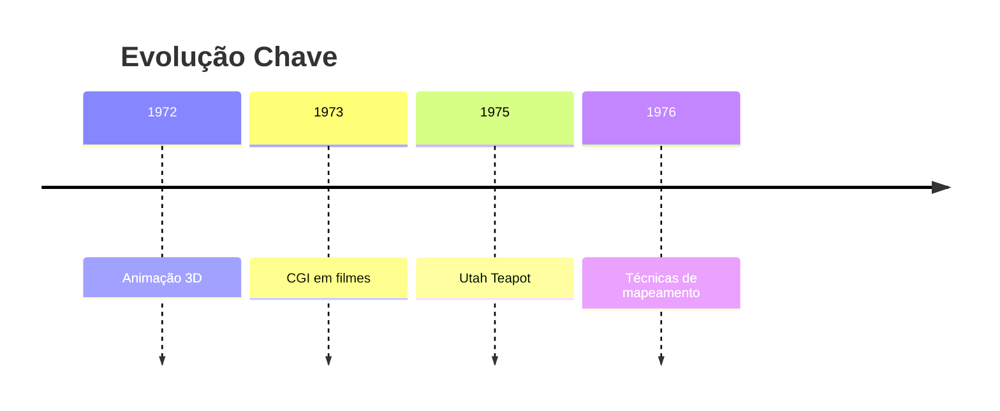
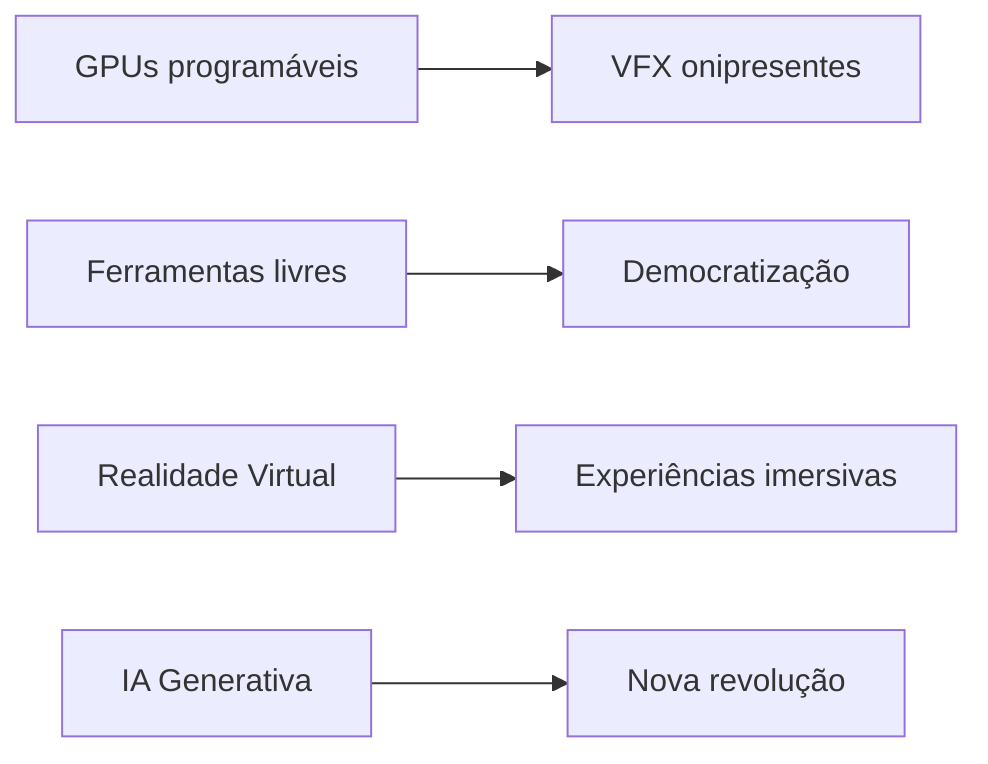
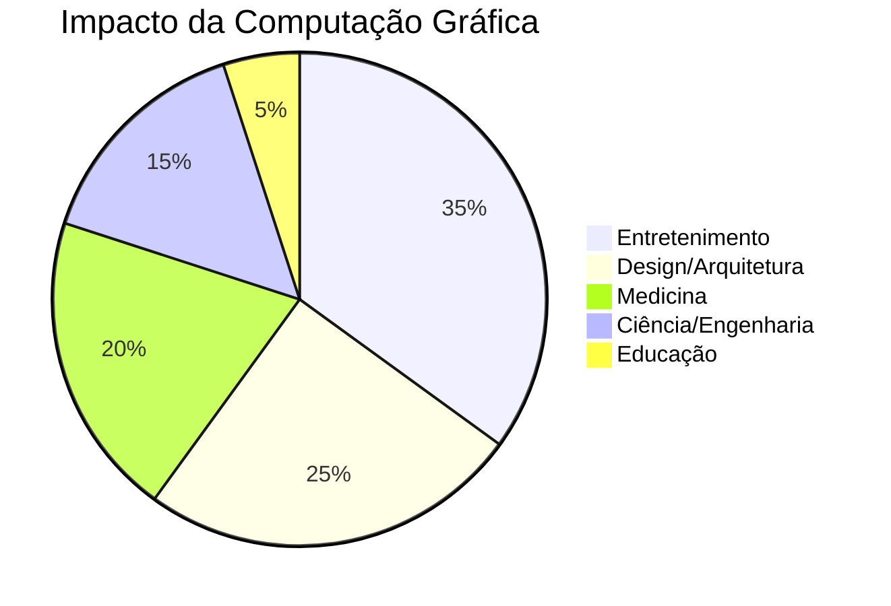

<!-- _class: lead -->
# Computação Gráfica: 
## Uma Jornada Visual

Principais marcos e revoluções

---

### **Anos 1950–1960: Os Primórdios**
#### Sementes da Revolução Gráfica

- 🖥️ **1950:** MIT Whirlwind I (1º display gráfico CRT)
- 🎮 **1961:** *Spacewar!* (1º jogo gráfico vetorial)
- ✏️ **1963:** **Sketchpad** (Ivan Sutherland - interfaces gráficas)
- ⚙️ Algoritmos-chave: 
  - Bresenham (linhas)
  - Sutherland-Hodgman (recorte)

---

### **Anos 1970: Consolidação**
#### Nascimento da Disciplina

- ✋ **1972:** 1ª animação 3D de uma mão (Ed Catmull)
- 🎬 **1973:** *Westworld* (1º uso de CGI em cinema)
- 🫖 **1975:** **Utah Teapot** (modelo 3D icônico)
- 🌐 **1976:** *Bump mapping* (James Blinn)

---

### **Anos 2000+: Hiper-realismo**
#### Democratização e Novas Fronteiras

- 🚀 Ray tracing em tempo real
- 🛠️ Blender, Unreal Engine, Unity
- 🌌 VR/AR e metaverso
- 🤖 Midjourney, DALL-E, Stable Diffusion

---

<!-- _class: lead -->
# Conclusão
## De Linhas à Realidade Imersiva

**Evolução chave:**

